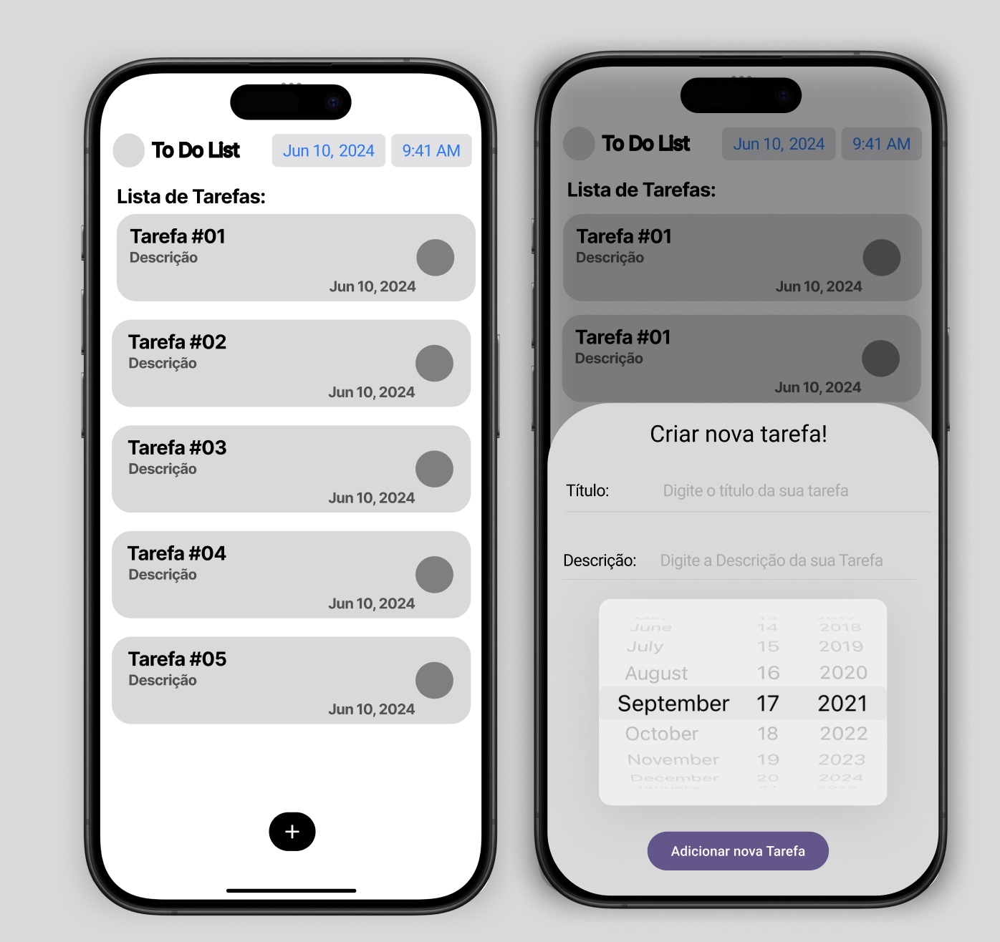

# to_do_app

Este é um aplicativo de Lista de Tarefas Simples feito em Flutter. No intuito para eu praticar meus conhecimentos no Framework.

Se quiser ver mais de como será o Projeto, entre [neste link do Figma](https://www.figma.com/design/LduvSEL4pxvPXO9ixmSfGb/To-Do-App-Project?node-id=0-1&t=inpMNtv3jMl5HdG6-1)

## Layouts

 

#### O que já foi feito?
- [X] HomeScreen;
- [X] Card Add ToDo;
- [X] Implementação de nova Tarefa;

### Dependências
- ``provider: ^6.1.2``

### Tecnologias utilizadas
- ``VSCode``
- ``Dart``
- ``Flutter``
- ``XCode = Emulador de IOs``
- ``Android Studio = Emulador Android``
- ``iPad = iPadOS``
